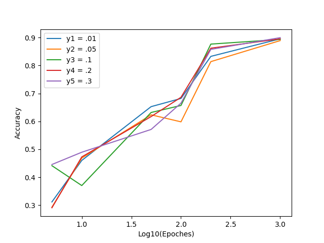

# Single Perceptron to Classify Ham/Spam emails

I used python to implement a Perceptron that can train on a set of HAM or SPAM emails and distinguish between new instances of HAM or SPAM emails after training.

Results of perceptron tests are shown below:

