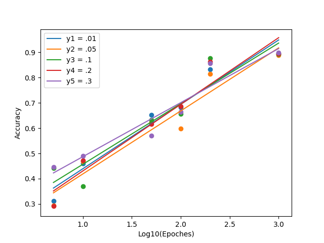

# Single Perceptron to Classify Ham/Spam emails

I used python to implement a Perceptron that can train on a set of HAM or SPAM emails and distinguish between new instances of HAM or SPAM emails after training.

Emails were first stemmed using the nltk porter stemmer, then converted into a bag of words (using python's Counter data structure). 

Optimized training - After first epoch, Counters made from emails are saved to a list for future epoches instead of regenerated per epoch. In a sample of 100 iterations, it reduced training runtime from 354 seconds to 11 seconds, essentially cutting down runtime by 97%.

**KNOWN ISSUE** - I currently feed in all of the data from one class first, then all of the other data from the other class second. This is problably leading to lower accuracies. Because the perceptron training algorithm stops learning as soon as it stops making mistakes, it only really benefits from the first few data points from each set as after the first few datapoints the algorithm stops making mistakes as it has trained "just enough" on that current epoch on that set. This means it "converges" quickly without using the whole set. Therefore my epoches are problably inefficent: more epoches are needed for higher accuracies. I am working on randomizing or alternating how I feed in the data to avoid this problem.  

## Files:
* **hw3.py** is the driver code. It parses and formats incoming emails that are eventually passed to the perceptron object for either training ot testing. The main code defaults to 100 epoches and a .1 learning rate. To run hw3.py:

    * python3 hw3.py \[AllStemmedHam\] \[AllStemmedSpam\] \[trainHamDir\] \[trainSpamDir\] \[testHamDir\] \[testSpamDir\]
        * AllStemmedHam : an already stemmed text file containing all of the words in all the HAM emails in the TRAINING set
        * AllStemmedSpam : an already stemmed text file containing all of the words in all the SPAM emails in the TRAINING set
        * trainHamDir : The directory where all the HAM emails in the TEST set are located
        * trainSpamDir : The directory where all the SPAM emails in the TEST set are located
        * testHamDir : The directory where all the HAM emails in the TEST set are located
        * testSpamDir : The directory where all the SPAM emails in the TEST set are located

* Sample Command:
    * python3 hw3.py stemmedFiles/train-ham-stemmed.txt stemmedFiles/train-spam-stemmed.txt train/ham train/spam test/ham test/spam

* **perceptron.py** is a class that stores the perceptron data and functions. It takes in a learning rate upon initialization and is passed in pre-stemmed BagOfWords Counter objects (instead of a traditional vector - we need to map individual words to their attribute values during both training and testing time which a vector can't do but a counter can) for training and testing.
* **batchRun.py** takes the same arguments as above, but runs 20 combinations of Epoches and learning rates. Takes a while, I run this overnight.
* **graph.py** just generated a graph form my results.
* **stemmer.py** is the script used to stem a directory of emails or individual emails. To run on an entire directory (used to generate AllStemmedHam and AllStemmedSpam> for HW3.py)
    * python3 stemmer.py \[dirPath\] \[outFile\]
        * dirPath : path of directory you want to convert to a stemmed file
        * outfile : name/path of stemmed file

# Results:

Results of perceptron tests are shown below, where I varied the learning rate (between .01 and .3) and number of epoches (between 5 and 1000):

Numerical Results:
    5 epoches with learning rate 0.01 has 0.3117154811715481 correct
    10 epoches with learning rate 0.01 has 0.4602510460251046 correct
    50 epoches with learning rate 0.01 has 0.6527196652719666 correct
    100 epoches with learning rate 0.01 has 0.6820083682008368 correct
    200 epoches with learning rate 0.01 has 0.8326359832635983 correct
    1000 epoches with learning rate 0.01 has 0.895397489539749 correct
    5 epoches with learning rate 0.05 has 0.2928870292887029 correct
    10 epoches with learning rate 0.05 has 0.4686192468619247 correct
    50 epoches with learning rate 0.05 has 0.6234309623430963 correct
    100 epoches with learning rate 0.05 has 0.5983263598326359 correct
    200 epoches with learning rate 0.05 has 0.8138075313807531 correct
    5 epoches with learning rate 0.1 has 0.44142259414225943 correct
    10 epoches with learning rate 0.1 has 0.3702928870292887 correct
    50 epoches with learning rate 0.1 has 0.6317991631799164 correct
    100 epoches with learning rate 0.1 has 0.6569037656903766 correct
    200 epoches with learning rate 0.1 has 0.8765690376569037 correct
    1000 epoches with learning rate 0.1 has 0.893305439330544 correct
    1000 epoches with learning rate 0.05 has 0.8891213389121339 correct
    5 epoches with learning rate 0.2 has 0.2907949790794979 correct
    10 epoches with learning rate 0.2 has 0.47280334728033474 correct
    50 epoches with learning rate 0.2 has 0.6171548117154811 correct
    100 epoches with learning rate 0.2 has 0.6861924686192469 correct
    200 epoches with learning rate 0.2 has 0.8619246861924686 correct
    1000 epoches with learning rate 0.2 has 0.895397489539749 correct
    5 epoches with learning rate 0.3 has 0.4456066945606695 correct
    10 epoches with learning rate 0.3 has 0.4895397489539749 correct
    50 epoches with learning rate 0.3 has 0.5711297071129707 correct
    100 epoches with learning rate 0.3 has 0.6652719665271967 correct
    200 epoches with learning rate 0.3 has 0.8577405857740585 correct
    1000 epoches with learning rate 0.3 has 0.899581589958159 correct
